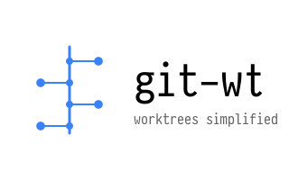

<center>
<picture>
  <source media="(prefers-color-scheme: dark)" srcset="docs/logo-dark.svg">
  <source media="(prefers-color-scheme: light)" srcset="docs/logo-light.svg">
  
</picture>
</center>

# git-wt

A git custom command that enhances Git's native worktree functionality with
interactive features, automation, and repository migration capabilities.

git-wt uses a [**bare repository** structure](https://gabri.me/blog/git-worktrees-done-right)
where the git data lives in a `.bare` directory and each branch gets its own
worktree directory. This provides better organization and a cleaner workspace
compared to the traditional `.git`-in-root approach.

## Why git worktrees?

Git worktrees allow you to have multiple branches checked out simultaneously in
different directories. This is useful for:

- Working on multiple features in parallel without stashing
- Reviewing PRs while keeping your work intact
- Running tests on one branch while developing on another
- Comparing implementations across branches side-by-side

## Features

- **Bare clone structure** - Git data in `.bare/`, each branch in its own
  directory
- **Interactive branch selection** with fzf for creating and switching worktrees
- **Repository migration** - convert existing repos to worktree structure
- **Automatic upstream tracking** when creating worktrees from remote branches
- **Multi-select support** for batch operations (remove, destroy)
- **Dry-run mode** for destructive operations
- **Preserves uncommitted changes** during migration (staged, unstaged, stashes)

## Dependencies

- `git` (2.48.0+ for relative worktree support)
- `fzf` (optional, for interactive commands)

## Installation

### Using Homebrew

```bash
brew tap ahmedelgabri/git-wt
brew install git-wt
```

Shell completions are automatically installed for bash, zsh, and fish.

### Using Nix Flakes

Add to your flake inputs:

```nix
{
  inputs.git-wt.url = "github:ahmedelgabri/git-wt";
}
```

Then add to your packages:

```nix
inputs.git-wt.packages.${system}.default
```

Or run directly:

```bash
nix run github:ahmedelgabri/git-wt
```

Shell completions are automatically available when installed via Nix.

### Manual Installation

```bash
curl -o ~/.local/bin/git-wt https://raw.githubusercontent.com/ahmedelgabri/git-wt/main/git-wt
chmod +x ~/.local/bin/git-wt
```

### Shell Completions

When installed via Homebrew or Nix, completions are automatically available.

For manual installation:

**Bash**

```bash
curl -o ~/.local/share/bash-completion/completions/git-wt \
	https://raw.githubusercontent.com/ahmedelgabri/git-wt/main/completions/git-wt.bash
```

**Zsh**

```bash
curl -o ~/.local/share/zsh/site-functions/_git-wt \
	https://raw.githubusercontent.com/ahmedelgabri/git-wt/main/completions/git-wt.zsh
```

**Fish**

```bash
curl -o ~/.config/fish/completions/git-wt.fish \
	https://raw.githubusercontent.com/ahmedelgabri/git-wt/main/completions/git-wt.fish
```

## Usage

### Clone a repository with worktree structure

```bash
git wt clone https://github.com/user/repo.git
```

This creates:

```
repo/
├── .bare/          # Git data (bare repository)
├── .git           # Points to .bare
└── main/          # Worktree for default branch
```

### Migrate an existing repository (Experimental)

```bash
cd existing-repo
git wt migrate
```

Converts your repo to the worktree structure while preserving all uncommitted
changes, staged files, and stashes.

### Create a new worktree

```bash
# Interactive mode - select from remote branches with fzf
git wt add

# From a remote branch
git wt add feature origin/feature

# Create new branch
git wt add -b new-feature new-feature

# All git worktree add flags are supported
git wt add --detach hotfix HEAD~5     # Detached HEAD
git wt add --lock -b wip wip-branch   # Locked worktree
git wt add --quiet -b feature feature # Suppress output
```

### Switch between worktrees

```bash
cd $(git wt switch)
```

### Remove worktrees

```bash
# Interactive multi-select
git wt remove

# Direct removal (local branch only)
git wt remove feature-branch

# Preview what would be removed
git wt remove --dry-run
```

### Destroy worktrees (removes remote branch too)

```bash
# Interactive with confirmation
git wt destroy

# Direct destruction
git wt destroy feature-branch
```

### Update default branch

```bash
git wt update # or: git wt u
```

Fetches all remotes and pulls the default branch (main/master).

### List worktrees

```bash
git wt list
```

## Commands

| Command              | Description                                                |
| -------------------- | ---------------------------------------------------------- |
| `clone <url>`        | Clone repo with worktree structure                         |
| `migrate`            | Convert existing repo to worktree structure (experimental) |
| `add [options] ...`  | Create new worktree (supports all git worktree flags)      |
| `remove [worktree]`  | Remove worktree and local branch                           |
| `destroy [worktree]` | Remove worktree and delete local + remote branches         |
| `update` / `u`       | Fetch all and update default branch                        |
| `switch`             | Interactive worktree selection                             |

All native `git worktree` commands (list, lock, unlock, move, prune, repair) are
also supported as pass-through.

## Development

```bash
# Enter development shell
nix develop

# Format code
nix fmt

# Run checks
nix flake check
```

## License

MIT
