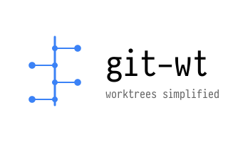

<center>
<picture>
  <source media="(prefers-color-scheme: dark)" srcset="docs/logo-dark.svg">
  <source media="(prefers-color-scheme: light)" srcset="docs/logo-light.svg">
  
</picture>
</center>

# git-wt

A Git custom command that makes Git worktrees easier to use with interactive
selection, safer destructive flows, repository migration, diagnostics, and
compact dashboards.

`git-wt` uses the [**bare repository** structure](https://gabri.me/blog/git-worktrees-done-right)
where Git data lives in `.bare/` and each branch gets its own sibling
worktree directory.

## Why Git Worktrees?

Git worktrees let you keep multiple branches checked out at the same time in
separate directories. They are useful for:

- working on multiple features in parallel without stashing
- reviewing PRs while keeping local work intact
- comparing implementations side by side
- running tests on one branch while developing on another

## Features

- **Bare clone structure** with `.bare/` for Git data
- **Interactive add / switch / remove** flows with fzf
- **Shell integration** with `git wt init` so `git wt switch` changes directory automatically
- **Lifecycle hooks** around worktree creation and removal (`wt.beforeadd`, `wt.afteradd`, `wt.beforeremove`, `wt.afterremove`)
- **Repository migration** from a standard repo to the bare worktree layout
- **Safe cleanup filters** with `git wt remove --sweep`
- **Repository diagnostics** with `git wt doctor`
- **Status dashboard** with `git wt status`
- **Machine-readable output** with `git wt list --json` or native `--porcelain -z`
- **Agent skill installer** with `git wt agent-skill`
- **Dry-run support** for destructive operations
- **Verified migration with a retained backup** of the original repository

## Dependencies

- `git` (`2.48.0+` for relative worktree support)

## Installation

### Homebrew

```bash
brew install ahmedelgabri/tap/git-wt
```

Shell completions are installed automatically for bash, zsh, and fish.

### mise

```bash
mise use "github:ahmedelgabri/git-wt"
```

### Nix Flakes

Add to your flake inputs:

```nix
{
  inputs.git-wt.url = "github:ahmedelgabri/git-wt";
}
```

Then add to your packages:

```nix
inputs.git-wt.packages.${system}.default
```

Or run directly:

```bash
nix run github:ahmedelgabri/git-wt
```

### Manual installation

Download the latest release archive for your platform from the
[releases page](https://github.com/ahmedelgabri/git-wt/releases/latest):

```bash
curl -sL https://github.com/ahmedelgabri/git-wt/releases/latest/download/git-wt-VERSION-OS-ARCH.tar.gz | tar xz
cp git-wt-VERSION-OS-ARCH/git-wt ~/.local/bin/
```

Replace `VERSION` with the current release version and choose the correct
platform archive.

### Shell completions

For manual installs, the release archives include a `completions/` directory:

```bash
# Bash
cp completions/git-wt.bash ~/.local/share/bash-completion/completions/git-wt

# Zsh
cp completions/_git-wt ~/.local/share/zsh/site-functions/_git-wt
cp completions/_git_wt ~/.local/share/zsh/site-functions/_git_wt # enables `git wt` completion

# Fish
cp completions/git-wt.fish ~/.config/fish/completions/git-wt.fish
```

For zsh, both completion files are needed:

- `_git-wt` completes the standalone `git-wt` command
- `_git_wt` bridges `git wt ...` when git/oh-my-zsh-style completion wrappers
  dispatch to the underscore form

### Agent skill

Install an [Agent Skills](https://agentskills.io/)-compatible skill so coding
agents can discover and use `git-wt` workflows:

```bash
git wt agent-skill
```

By default this writes `~/.agents/skills/git-wt/SKILL.md`. Use
`git wt agent-skill --dir ~/.claude/skills` for a different skill root,
`--print` to review the skill, or `--force` to overwrite an existing copy.

## Usage

### Clone with the bare worktree layout

```bash
git wt clone https://github.com/user/repo.git
```

This creates:

```text
repo/
├── .bare/         # Git data (bare repository)
├── .git           # gitdir pointer to .bare
└── main/          # Worktree for the default branch
```

### Migrate an existing repository

```bash
cd existing-repo
git wt migrate
```

Migration is experimental. Stop other Git operations and file writers first. It copies the complete Git database, including packed refs, stashes, reflogs, hooks, and local configuration, then restores the current worktree without checking out committed files over local deletions. It verifies file contents and modes, index entries, refs, stashes, and object connectivity before accepting the new layout.

The original repository remains in a sibling `<repo>-backup-*` directory. Keep it until you have checked your worktrees and configuration. Migration requires enough free space for a full copy and refuses unsupported layouts or in-progress Git operations. See [migration and removal safety](docs/safety.md) for limitations and recovery.

### Create a worktree

```bash
# Interactive mode

git wt add

# From a remote branch
git wt add feature origin/feature

# Create a new branch
git wt add -b new-feature new-feature

# Detached, locked, or quiet modes
git wt add --detach hotfix HEAD~5
git wt add --lock -b wip wip-branch
git wt add --quiet -b feature feature
```

### Switch worktrees

```bash
cd "$(git wt switch)"
```

### Shell integration (automatic cd)

A subprocess can never change its parent shell's directory, so by default
`switch` prints the worktree path. The `init` command emits a small
shell script that wraps the binary and runs the `cd` for you:

```bash
# bash (~/.bashrc)
eval "$(git-wt init bash)"

# zsh (~/.zshrc)
eval "$(git-wt init zsh)"

# fish (~/.config/fish/config.fish)
git-wt init fish | source
```

After sourcing, `git wt switch` changes directory directly. Only `switch`
is intercepted: `add` keeps printing the created worktree path to stdout
so scripts and hooks (like the Claude Code `WorktreeCreate` hook below)
can rely on it. The script also defines a thin `git()` wrapper so the
`git wt` spelling works; if another tool already wraps `git`, use
`eval "$(git-wt init zsh --no-git-wrapper)"` and invoke `git-wt switch`
instead.

Known limitation: the wrapper keys on the first argument, so global git
flags before the subcommand (e.g. `git -C <path> wt switch`) bypass it
and print the path instead of changing directory.

### Remove a worktree and local branch

```bash
git wt remove feature-branch
git wt remove --dry-run feature-branch
```

Removal refuses dirty worktrees and commits without another retained branch or tag. To deliberately discard that work, use `git wt remove --force <worktree>` and confirm the warning. Hooks cannot bypass these checks; removal checks again after before-hooks run.

### Remove a worktree and local + remote branch

```bash
git wt remove feature-branch --delete-remote
```

Remote deletion uses each target branch's configured upstream remote and branch name, not the invoking worktree's default remote. Targets without a remote upstream keep remote branches untouched. A lease prevents deleting a remote branch that changed after verification.

### Sweep safe cleanup candidates

```bash
git wt remove --sweep

git wt remove --sweep --dry-run
```

Both `--merged` and `--gone` require the branch to be fully merged into the default branch. A missing upstream alone is not safe to delete. `--stale` selects only missing, unlocked worktree paths with attached branches and preserves those branches. Detached metadata is retained. `--force` cannot be combined with cleanup filters.

### Inspect repository health

```bash
git wt doctor
```

### Show worktree status

```bash
git wt status
```

### List worktrees

```bash
git wt list
git wt ls
git wt list --json
git wt ls --json
git wt list --porcelain -z
```

`ls` is an alias for `list`. Without `--json`, native Git options and output pass through unchanged. JSON mode returns an array of non-bare worktrees with absolute paths, full HEAD object IDs, branch names, and detached/locked/prunable metadata. An empty list is `[]`. Do not combine `--json` with native output options such as `--porcelain` or `-z`. See the [JSON schema](docs/safety.md#updates-and-scripting) for field definitions.

### Update the default branch

```bash
git wt update # or: git wt u
```

Updates are fast-forward-only. Fetching prunes stale remote-tracking branches, not local-only tags.

## Hooks

Run shell commands around worktree creation and removal. Hooks are configured through Git config, so they can be scoped per repository or globally with `--global`.

```bash
# Validate the repository before creating a worktree
git config --add wt.beforeadd './scripts/check-worktree.sh'

# Copy generated files into each new worktree
git config --add wt.afteradd 'cp ../main/compile_commands.json .'

# Clean up files while the worktree still exists
git config --add wt.beforeremove './scripts/cleanup-worktree.sh'

# Notify another tool after removal is complete
git config --add wt.afterremove 'workspace-registry remove "$GIT_WT_PATH"'
```

| Hook              | When it runs                                                               | Working directory      | Failure behavior                                        |
| ----------------- | -------------------------------------------------------------------------- | ---------------------- | ------------------------------------------------------- |
| `wt.beforeadd`    | After add arguments and fetching are complete, immediately before creation | Bare repository root   | Prevents worktree creation                              |
| `wt.afteradd`     | After creation and upstream configuration                                  | New worktree           | Leaves the worktree in place and exits non-zero         |
| `wt.beforeremove` | Immediately before removal                                                 | Worktree being removed | Preserves the worktree and exits non-zero               |
| `wt.afterremove`  | After worktree and branch cleanup                                          | Bare repository root   | Removal remains complete and the command exits non-zero |

Every hook receives the lifecycle context through environment variables:

- `GIT_WT_EVENT`: `beforeadd`, `afteradd`, `beforeremove`, or `afterremove`
- `GIT_WT_PATH`: absolute worktree path
- `GIT_WT_BRANCH`: branch name, or empty for detached or unresolved cases
- `GIT_WT_BARE_ROOT`: absolute bare repository root

Each configured value runs with `sh -c`. Repeated `git config --add` values run in order and stop at the first failure for that event; multiline values are supported. Hook output goes to stderr so successful `git wt add` output remains machine-readable.

Before-hooks are not transactional: the subsequent Git operation can still fail after a hook succeeds, so side effects should be idempotent. After-hook failures cannot roll back an operation that already completed. Removing the current worktree or a locked worktree is rejected before any hook runs; for stale, missing, or prunable worktrees the removal proceeds with the hooks skipped. `DEBUG=1` echoes hooks instead of running them.

Hooks apply to `git wt add` and `git wt remove`; initial worktrees created by `clone` or `migrate` do not trigger git-wt add hooks. Migration also suppresses native checkout hooks while building the new layout.

## Commands

| Command             | Description                                               |
| ------------------- | --------------------------------------------------------- |
| `clone <url>`       | Clone a repo with the bare worktree structure             |
| `migrate`           | Convert an existing repo to the bare worktree structure   |
| `add [options] ...` | Create a new worktree                                     |
| `remove` / `rm`     | Remove worktrees directly or by safe cleanup filters      |
| `doctor`            | Run repository diagnostics                                |
| `agent-skill`       | Install the git-wt agent skill                            |
| `init <shell>`      | Print shell integration for automatic directory switching |
| `status`            | Show a compact dashboard for linked worktrees             |
| `list` / `ls`       | List worktrees with native Git output or JSON             |
| `switch`            | Interactively select a worktree                           |
| `update` / `u`      | Fetch remotes and update the default branch               |

Native `git worktree` commands (`lock`, `unlock`, `move`, `prune`, `repair`) are also supported as pass-through commands. `add` requires the `.bare` layout and rejects standard `.git` directories with a migration hint.

## Claude Code Integration

[Claude Code](https://claude.ai/code) can create and remove worktrees
automatically during agentic sessions. Configure the `WorktreeCreate` and
`WorktreeRemove` hooks in your project or user `settings.json` to delegate
those operations to `git wt`, keeping every worktree consistent with the bare
repository layout:

```json
{
  "WorktreeCreate": [
    {
      "hooks": [
        {
          "type": "command",
          "command": "git wt add \"$(cat /dev/stdin | jq -r '.name')\""
        }
      ]
    }
  ],
  "WorktreeRemove": [
    {
      "hooks": [
        {
          "type": "command",
          "command": "echo y | git wt rm \"$(cat /dev/stdin | jq -r '.worktree_path')\""
        }
      ]
    }
  ]
}
```

The hooks receive a JSON payload on stdin. `WorktreeCreate` reads the `.name`
field (the branch name) and passes it to `git wt add`. `WorktreeRemove` reads
`.worktree_path` and passes it to `git wt rm`; the leading `echo y |` confirms
the interactive prompt non-interactively.

The removal hook refuses dirty worktrees or unpreserved commits. Handle its non-zero exit rather than automatically adding `--force`; forcing removal can discard the agent's work.

## Development

```bash
# Enter development shell
nix develop

# Format code
nix fmt

# Run all checks
nix flake check
```

## License

MIT
