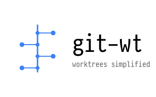

<center>
<picture>
  <source media="(prefers-color-scheme: dark)" srcset="docs/logo-dark.svg">
  <source media="(prefers-color-scheme: light)" srcset="docs/logo-light.svg">
  
</picture>
</center>

# git-wt

Work on several Git branches at once, each in its own directory. No need to stash changes when switching tasks.

`git-wt` helps you create, switch, and remove these directories, called worktrees. Pick branches interactively or pass their names directly.

It stores Git data in `.bare/`, with your worktrees next to it:

```text
my-project/
├── .bare/       # Shared Git data
├── .git         # Points to .bare
├── main/        # Main branch
└── feature/     # Feature branch
```

Read [why this layout works](https://gabri.me/blog/git-worktrees-done-right).

## Contents

- [Installation](#installation)
  - [Homebrew](#homebrew)
  - [mise](#mise)
  - [Nix flakes](#nix-flakes)
  - [Manual installation](#manual-installation)
  - [Shell completions](#shell-completions)
- [Usage](#usage)
  - [Clone a repository](#clone-a-repository)
  - [Convert an existing repository](#convert-an-existing-repository)
  - [Create a worktree](#create-a-worktree)
  - [Switch worktrees](#switch-worktrees)
  - [Remove worktrees](#remove-worktrees)
  - [Check and update worktrees](#check-and-update-worktrees)
- [Commands](#commands)
- [Hooks](#hooks)
- [Coding agents](#coding-agents)
- [Development](#development)
- [License](#license)

## Installation

Requires Git 2.36 or newer. Relative worktree paths require Git 2.48 or newer.

### Homebrew

```bash
brew install ahmedelgabri/tap/git-wt
```

Includes shell completions for bash, zsh, and fish.

### mise

```bash
mise use "github:ahmedelgabri/git-wt"
```

### Nix flakes

Run without installing:

```bash
nix run github:ahmedelgabri/git-wt
```

Or add it to your flake inputs:

```nix
{
  inputs.git-wt.url = "github:ahmedelgabri/git-wt";
}
```

Then include `inputs.git-wt.packages.${system}.default` in your packages.

### Manual installation

Download the archive for your platform from the [latest release](https://github.com/ahmedelgabri/git-wt/releases/latest).

Extract it and copy `git-wt` to a directory in your `$PATH`:

```bash
tar xzf git-wt-VERSION-OS-ARCH.tar.gz
cp git-wt-VERSION-OS-ARCH/git-wt ~/.local/bin/
```

Replace `VERSION`, `OS`, and `ARCH` with the values in the archive name.

### Shell completions

For manual installs, copy files from the archive's `completions/` directory:

```bash
# Bash
cp completions/git-wt.bash ~/.local/share/bash-completion/completions/git-wt

# Zsh
cp completions/_git-wt ~/.local/share/zsh/site-functions/_git-wt
cp completions/_git_wt ~/.local/share/zsh/site-functions/_git_wt

# Fish
cp completions/git-wt.fish ~/.config/fish/completions/git-wt.fish
```

Zsh needs both files. `_git-wt` completes `git-wt`; `_git_wt` completes `git wt`.

## Usage

### Clone a repository

```bash
git wt clone https://github.com/user/repo.git
cd repo
```

This creates the `.bare/` layout and a worktree for the default branch.

If setup fails after downloading, git-wt keeps the repository and prints recovery instructions.

### Convert an existing repository

```bash
cd existing-repo
git wt migrate
```

Migration is experimental. Stop editors, builds, and other Git operations before running it.

It moves your files into a worktree and changes `.git` to `.bare`. It checks that your files and Git state survived the move.

A failed or interrupted migration restores the original layout. After a crash, run `git wt migrate` again to restore it.

Read the [migration limits and recovery guide](docs/safety.md#migration) before converting a repository.

### Create a worktree

```bash
# Choose a branch interactively
git wt add

# Use an existing remote branch
git wt add feature origin/feature

# Create a new branch and worktree
git wt add -b new-feature new-feature
```

`add` requires the `.bare/` layout. It prints the new worktree's path so scripts can use it.

Run `git wt add --help` for more options.

### Switch worktrees

```bash
cd "$(git wt switch)"
```

To let `git wt switch` change directories directly, add the matching line to your shell configuration:

```bash
# Bash: ~/.bashrc
eval "$(git-wt init bash)"

# Zsh: ~/.zshrc
eval "$(git-wt init zsh)"

# Fish: ~/.config/fish/config.fish
git-wt init fish | source
```

Reload your shell configuration, then use `git wt switch`.

This also defines a `git` shell function. If another tool already defines one, use `--no-git-wrapper` and call `git-wt switch` instead.

Git options before `wt`, such as `git -C <path> wt switch`, bypass the function and only print the path.

### Remove worktrees

Preview removal, then remove the worktree and its local branch:

```bash
git wt remove --dry-run feature
git wt remove feature
```

To also delete its configured remote branch:

```bash
git wt remove feature --delete-remote
```

To clean up merged branches and missing worktrees:

```bash
git wt remove --sweep --dry-run
git wt remove --sweep
```

Keep these rules in mind:

- Save valuable ignored files first. Removal deletes them, including ignored `.env` files.
- git-wt checks for changed files and commits that no other branch or tag keeps.
- On a terminal, discarding that work requires typing the worktree name. Without a terminal, git-wt skips it and exits 1.
- `--force` discards that work without asking. With `--delete-remote`, it can also delete commits pushed by others that you have not fetched.
- Cleanup filters do not accept `--force`. A deleted remote branch alone does not make a worktree safe to remove.

See [removal safety](docs/safety.md#removal) for cleanup settings and remote deletion rules.

### Check and update worktrees

```bash
# List worktrees
git wt list

# List as JSON
git wt list --json

# Show changes across worktrees
git wt status

# Check for repository problems
git wt doctor

# Fetch remotes and pull the default branch
git wt update
```

`update` uses your Git settings for pulling and pruning tags. Tag pruning can delete local-only tags if enabled.

See [update settings and the JSON format](docs/safety.md#updates-and-scripting) for details.

## Commands

| Command         | Purpose                                     |
| --------------- | ------------------------------------------- |
| `clone <url>`   | Clone into the `.bare/` layout              |
| `migrate`       | Convert an existing repository              |
| `add`           | Create a worktree                           |
| `switch`        | Pick a worktree to switch to                |
| `remove` / `rm` | Remove worktrees and branches               |
| `list` / `ls`   | List worktrees, with optional JSON output   |
| `status`        | Show changes across worktrees               |
| `doctor`        | Check for repository problems               |
| `update` / `u`  | Fetch remotes and update the default branch |
| `init <shell>`  | Set up automatic directory switching        |
| `agent-skill`   | Install instructions for coding agents      |

`lock`, `unlock`, `move`, `prune`, and `repair` use the matching native `git worktree` commands.

Run `git wt <command> --help` for options.

## Hooks

Run shell commands before or after creating and removing worktrees. Configure them per repository, or add `--global` for all repositories.

```bash
git config --add wt.afteradd 'cp ../main/compile_commands.json .'
```

| Hook              | Runs in                          |
| ----------------- | -------------------------------- |
| `wt.beforeadd`    | Repository root, before creation |
| `wt.afteradd`     | New worktree, after creation     |
| `wt.beforeremove` | Worktree, before removal         |
| `wt.afterremove`  | Repository root, after removal   |

Hooks receive the path in `$GIT_WT_PATH` and the branch name in `$GIT_WT_BRANCH`.

Before-hooks can stop the operation. After-hook failures report an error but do not undo completed work.

Hooks apply to `add` and `remove`, not `clone` or `migrate`. See the [hook reference](docs/index.md#hooks) for environment variables and failure rules.

## Coding agents

Install [agent instructions](https://agentskills.io/) for git-wt:

```bash
git wt agent-skill
```

This writes `~/.agents/skills/git-wt/SKILL.md`. Use `--dir ~/.claude/skills` to choose another location, or `--print` to read it first.

Claude Code can also use git-wt to create and remove worktrees. See the [Claude Code setup](docs/index.md#claude-code-integration).

Do not automatically add `--force` when an agent's removal fails. It can discard the agent's work.

## Development

```bash
nix develop          # Enter the development shell
nix fmt              # Format files
nix flake check      # Check the build and formatting
go test ./...        # Run Go tests
bats tests/          # Run end-to-end tests
```

See the [development guide](docs/ci-cd-setup.md) for CI and release details.

## License

[MIT](LICENSE)
